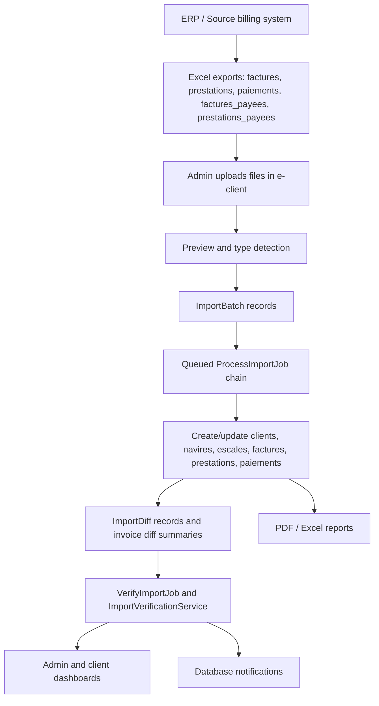
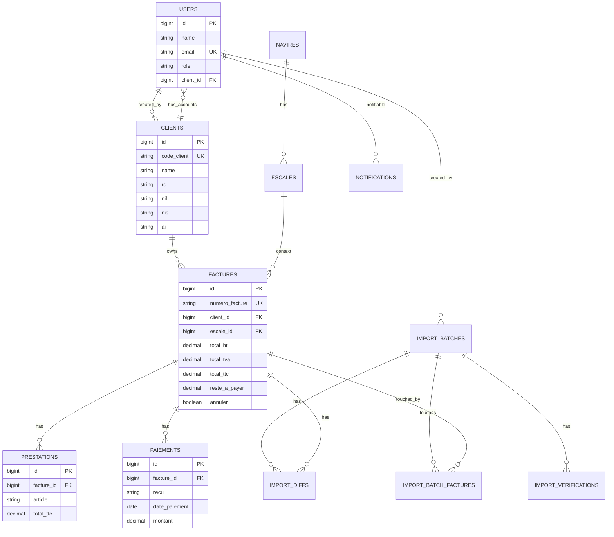
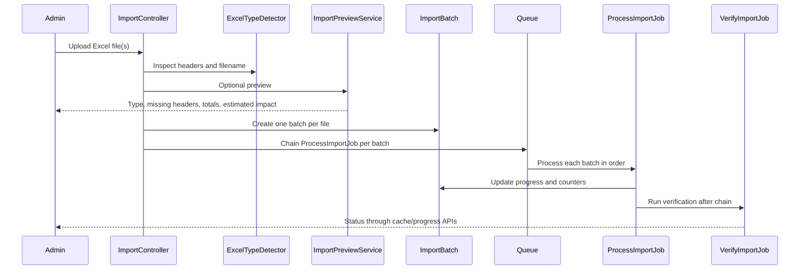
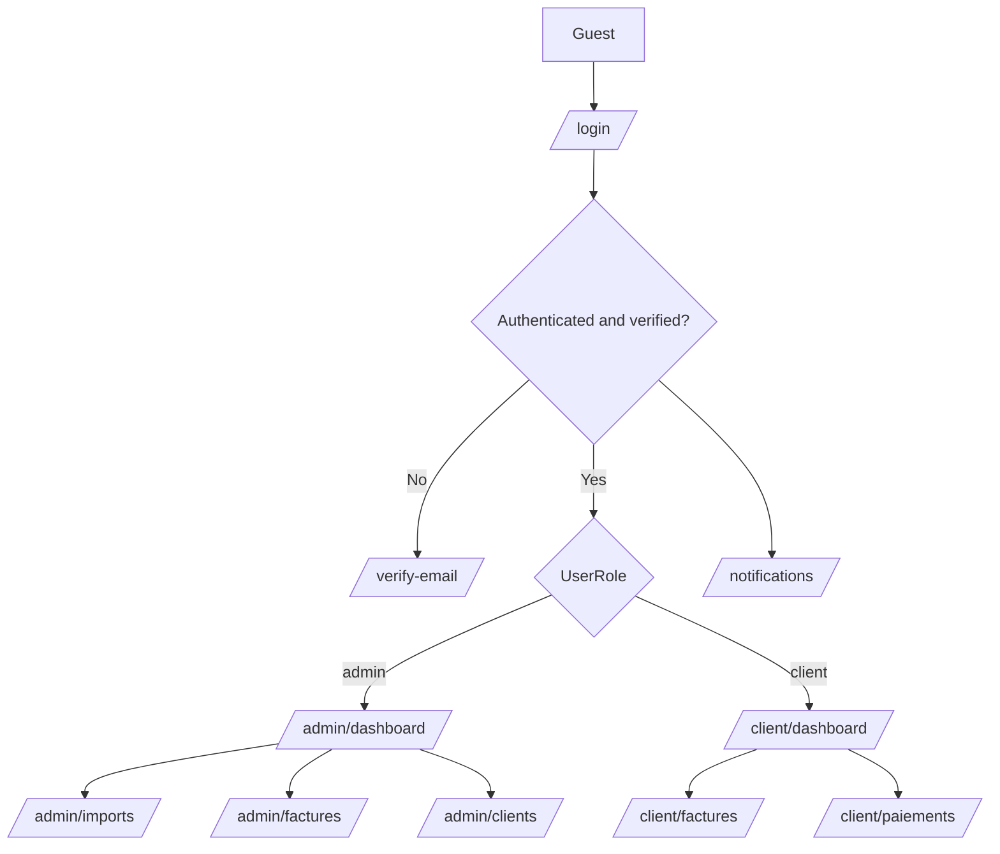

# e-client

Technical reference for the Laravel application currently named **e-client** / **E-Client - EPO**.

This README was generated from the repository source, migrations, route list, package manifests, and the current Laravel Boost application metadata. It is intended to let another developer or AI agent continue work without first reading the entire codebase.

> Important: the live database inspected during this analysis did not fully match the repository migrations. This README documents the repository-defined application first, and calls out schema drift in [Known Issues](#known-issues-and-technical-debt).

## Table of Contents

- [Project Overview](#project-overview)
- [Recent Functional Updates](#recent-functional-updates)
- [Business Context](#business-context)
- [Core Features](#core-features)
- [Technical Architecture](#technical-architecture)
- [Project Structure](#project-structure)
- [Domain Models](#domain-models)
- [Database Structure](#database-structure)
- [Roles and Permissions](#roles-and-permissions)
- [Import System](#import-system)
- [Data Integrity System](#data-integrity-system)
- [Dashboards](#dashboards)
- [Notification System](#notification-system)
- [Reports and Exports](#reports-and-exports)
- [Routes and Application Flow](#routes-and-application-flow)
- [Frontend](#frontend)
- [Security](#security)
- [Local Development Setup](#local-development-setup)
- [Dependencies](#dependencies)
- [Critical Components](#critical-components)
- [Existing Optimizations](#existing-optimizations)
- [Known Issues and Technical Debt](#known-issues-and-technical-debt)
- [Future Roadmap](#future-roadmap)
- [AI Agent Handoff Notes](#ai-agent-handoff-notes)

## Project Overview

**Project name:** `e-client` / `E-Client - EPO`

**Business purpose:** A Laravel portal that exposes ERP-sourced billing, payment, and port-service data to internal administrators and external client users. The codebase revolves around invoices (`factures`), services (`prestations`), payments (`paiements`), clients, vessels (`navires`), port calls (`escales`), Excel imports, integrity checks, dashboards, notifications, and exports.

**Problem being solved:** ERP data is exported to Excel and imported into this application so users can:

- synchronize invoices, prestations, paid invoices, paid prestations, and payments;
- detect mismatches between imported files and existing application data;
- expose client-specific invoice/payment views;
- alert admins and clients about imports, payment updates, unpaid invoices, overdue invoices, and data integrity issues;
- generate dashboards, PDF invoices, and payment exports.

**Target users:**

- **Admins:** manage clients, monitor all invoices/payments/imports, run integrity checks, inspect import diffs, and receive operational alerts.
- **Client users:** view their own invoices and payments, export payment history, print invoices, and receive invoice/payment notifications.

**High-level application type:** Server-rendered Laravel web application using Blade, Alpine.js, Tailwind CSS, Chart.js, queued background jobs, MySQL, database notifications, and Excel/PDF libraries.

### Recent Functional Updates

- `superadmin` is now a first-class role in the codebase and routes can be shared with admins where appropriate.
- Public registration now requires a `code_client` and creates an inactive client account linked to an existing client record.
- Client users have a dedicated support ticket flow linked to invoices.
- The client shell now uses a responsive sidebar with a minimal top bar.
- Import files now have a configurable retention policy and cleanup/audit commands.

## Business Context

The repository strongly indicates a port-services billing context:

- invoice lines are called `prestations`;
- vessel and port-call entities exist as `navires` and `escales`;
- PDF output references port services;
- amounts are primarily in Algerian dinars (`DA`);
- client identifiers include Algerian legal/fiscal fields such as `RC`, `NIF`, `NIS`, and `AI`.

### Role of the Application

The application acts as a client-facing synchronization and reporting layer around ERP data. It is not the ERP itself. The code shows a one-way data flow from ERP Excel exports into `e-client`; no direct ERP API or write-back integration was found.

### Business Workflows

1. ERP produces Excel exports for invoices, prestations, payments, paid invoices, and paid prestations.
2. Admin uploads up to five Excel files through the import screen.
3. The application detects each file type by headers and filename.
4. The application creates one `ImportBatch` per file and processes the batches in a fixed order.
5. Import jobs upsert domain data and record row-level changes.
6. A verification job checks invoice/payment/service consistency.
7. Dashboards and invoice views reflect the synchronized data.
8. Notifications are sent to admins and client users.

### Complete Business Workflow



### Data Lifecycle

- **Source:** ERP Excel files.
- **Ingestion:** `Admin\ImportController` stores uploaded files under `storage/app/private/imports/{type}` and creates `import_batches`.
- **Processing:** `ProcessImportJob` runs Maatwebsite Excel imports in chunks.
- **Synchronization:** imports use `upsert` by business keys.
- **Delta tracking:** `ImportDeltaService` creates `import_diffs` and updates invoice diff summary columns.
- **Integrity validation:** `ImportVerificationService` persists rule-level findings and updates invoice verification flags.
- **Consumption:** dashboards, invoice/payment lists, detail pages, PDFs, Excel exports, and notifications.

## Core Features

### Invoice Management

Invoices are stored in `factures` and modeled by `App\Models\Facture`.

Implemented behavior:

- list all invoices for admins with search, client filter, status filter, verification filter, import-diff filter, date filters, amount filters, sorting, pagination, and aggregate stats;
- list only the authenticated client's invoices for client users;
- invoice detail pages for admins and clients;
- PDF invoice printing through Dompdf;
- invoice states are inferred from fields:
  - canceled: `annuler = true`;
  - paid: active invoice with `reste_a_payer <= 0`;
  - unpaid: active invoice with `reste_a_payer > 0`;
- verification and import-diff badges are shown when the corresponding columns exist.

Important files:

- `app/Http/Controllers/FactureController.php`
- `app/Http/Controllers/Client/FactureController.php`
- `app/Models/Facture.php`
- `resources/views/admins/factures/*`
- `resources/views/clients/factures/*`
- `resources/views/shared/prints/factures/pdf.blade.php`

### Services / Prestations Management

Prestations are invoice line items stored in `prestations` and modeled by `App\Models\Prestation`.

Implemented behavior:

- imported from `prestations` and `prestations_payees` Excel files;
- attached to invoices by invoice number during import;
- upserted by `facture_id + article`;
- used on invoice detail and PDF invoice output;
- validated against invoice totals by the integrity system.

No standalone CRUD routes for prestations were found. They are managed through imports and displayed through invoice pages.

### Payments Management

Payments are stored in `paiements` and modeled by `App\Models\Paiement`.

Implemented behavior:

- admin payment index with search, bank/date filters, sorting, and pagination;
- client payment index restricted to the authenticated user's `client_id`;
- client payments grouped by `numero_cheque` in the UI;
- payment imports upsert by `facture_id + recu`;
- payment imports update `factures.reste_a_payer`;
- payment balance is verified against invoice totals;
- client users can export payments to Excel and PDF.

Important files:

- `app/Http/Controllers/PaiementController.php`
- `app/Http/Controllers/Client/PaiementController.php`
- `app/Imports/PaiementsImport.php`
- `app/Exports/Client/PaiementsExport.php`

### Client Support Tickets

Support tickets are stored in `support_tickets` and modeled by `App\Models\SupportTicket`.

Implemented behavior:

- client users can open a support ticket from an invoice detail page;
- the support form can be pre-filled with `facture_id`;
- ticket creation is restricted to the authenticated client's own invoices;
- ticket status values are `ouvert`, `en_cours`, and `resolu`;
- priority values are `normal` and `urgent`;
- the client support area shows ticket history with filters and pagination.

Important files:

- `app/Http/Controllers/Client/SupportTicketController.php`
- `app/Models/SupportTicket.php`
- `resources/views/clients/support/*`
- `resources/views/clients/factures/show.blade.php`

### User Management and RBAC

The application now formalizes `superadmin` alongside `admin` and `client`.

Implemented behavior:

- public registration requires a `code_client` that exists in `clients`;
- registration creates a client account with `client_id` and `is_validated = false`;
- Breeze login rejects non-validated accounts before the session is kept alive;
- admins and superadmins can access the administrative user list;
- only superadmins can create, edit, or delete users;
- admins and superadmins can toggle validation status;
- the last superadmin and the current user are protected from accidental deactivation;
- the admin shell includes a dedicated "Gestion des utilisateurs" entry.

Important files:

- `app/UserRole.php`
- `app/Models/User.php`
- `app/Http/Middleware/RoleMiddleware.php`
- `app/Http/Controllers/Auth/RegisteredUserController.php`
- `app/Http/Controllers/Admin/UserManagementController.php`
- `resources/views/admins/users/*`

### Import File Retention and Audit

The import subsystem now includes an explicit file lifecycle policy.

Implemented behavior:

- completed import files can be purged after a configurable retention period;
- cleanup is available through `php artisan imports:cleanup`;
- `--dry-run` lets operators simulate the cleanup before deleting anything;
- `php artisan imports:audit-storage` reports orphaned files and missing files;
- cleanup writes structured logs to a dedicated `imports-cleanup` channel;
- import verification and diff history remain in the database after file deletion;
- the import scheduler runs the cleanup command daily at 02:00 when enabled.

Important files:

- `app/Console/Commands/CleanupImportFiles.php`
- `app/Console/Commands/AuditImportStorage.php`
- `config/imports.php`
- `config/logging.php`
- `routes/console.php`

### Paid Invoices and Paid Prestations

The import system supports two additional import batch types:

- `factures_payees`
- `prestations_payees`

These reuse invoice/prestation schemas with paid-file semantics. They are processed after unpaid/current files according to `Admin\ImportController::ORDER`.

Notable behavior:

- `FacturesPayeesImport` does not force cancellation to false when the `annule` column is missing; this is covered by tests.
- `PrestationsPayeesImport` looks up only active invoices (`annuler = 0`) when attaching paid prestations.

### Excel Imports

Supported file extensions:

- `.xlsx`
- `.xls`

Controller validation:

- maximum 5 files per import request;
- maximum 100 MB per file;
- adaptive upload input `files[]`;
- legacy file inputs:
  - `file_factures`
  - `file_prestations`
  - `file_paiements`
  - `file_factures_payees`
  - `file_prestations_payees`

### Data Integrity Controls

Implemented through:

- `ImportDeltaService` for row-level import differences;
- `ImportVerificationService` for business rule verification;
- `ImportDiff` and `ImportVerification` models;
- invoice summary columns such as `verification_status`, `verification_flags`, `import_diff_status`, and `import_diff_summary`.

### Dashboards

Admin and client dashboards use aggregate SQL, Chart.js charts, Blade components, and KPI cards.

Admin dashboard:

- financial totals;
- recovery rate;
- paid/unpaid/canceled invoice counts;
- total clients;
- 12-month payment chart;
- recent imports;
- recent invoices;
- recent payments;
- weekly activity;
- data health summary and global verification status.

Client dashboard:

- client-specific invoice count;
- total invoiced;
- total paid;
- remaining balance;
- recovery rate;
- paid/unpaid/canceled counts;
- 12-month payment chart;
- recent invoices;
- recent payments;
- oldest unpaid invoices.

### Notifications

The application uses Laravel database notifications only. No mail, SMS, or realtime broadcast delivery was found in the implemented code.

Implemented notification categories:

- admin import queued/completed/failed alerts;
- admin integrity verification queued/completed/failed alerts;
- admin rule-specific integrity alerts;
- admin import-diff and payment inconsistency alerts;
- client invoice updated alerts;
- client new payment alerts;
- client unpaid invoice alerts;
- client overdue invoice alerts.

### Reports and Exports

Implemented:

- invoice PDF stream via Dompdf;
- client payment Excel export via Maatwebsite Excel;
- client payment PDF export via Dompdf;
- `ImportReportGenerator` renders `resources/views/reports/import-summary.blade.php`, but no public route to this generator was found.

### Audit History

Implemented history mechanisms:

- `import_batches` keep import history;
- `import_diffs` track row/entity deltas per import;
- `import_verifications` persist integrity rule results;
- `notifications` and `notification_deduplications` track alert history;
- `created_by`, timestamps, and `deleted_at` columns exist in several migrations.

Important caveat: migrations add `deleted_at` to `clients`, `factures`, and `paiements`, but the corresponding models do not currently use Laravel's `SoftDeletes` trait. As written, Eloquent `delete()` calls will hard-delete rows unless this is fixed.

## Technical Architecture

### Runtime and Framework

Detected through Laravel Boost and package metadata:

- PHP runtime in current environment: **8.5**
- Composer requirement: `php: ^8.2`
- Laravel framework: **12.56.0**
- Database engine currently connected: **MySQL**
- Frontend build: Vite + Tailwind CSS + Alpine.js
- Queue default: database queue
- Cache default in config: database cache
- `.env.example` sets `SESSION_DRIVER=redis`, `CACHE_STORE=database`, and `QUEUE_CONNECTION=database`

### Main Packages

Composer packages used by application code:

- `laravel/framework` 12.56.0: application framework.
- `laravel/breeze` 2.4.1: authentication scaffolding.
- `laravel/telescope` 5.20.0: local observability/debugging.
- `maatwebsite/excel` 3.1.68: Excel imports and exports.
- `barryvdh/laravel-dompdf` 3.1.2: PDF rendering.
- `kwn/number-to-words` 2.12.0: French amount-in-words conversion for invoices.
- `predis/predis` 3.4.2: Redis client support.
- `php-ai/php-ml` 0.10.0: installed and used indirectly by local analytics/AI-style services; no external AI API integration found.

NPM packages used by application code:

- `alpinejs` 3.15.8: frontend interactivity.
- `chart.js` 4.5.1: dashboard charts.
- `axios` 1.13.5: notification feed polling.
- `tailwindcss` 3.4.19 and `@tailwindcss/forms` 0.5.11: styling.
- `vite` 7.3.1 and `laravel-vite-plugin` 2.1.0: asset pipeline.
- `@fortawesome/fontawesome-free` 7.2.0: installed; the current app mainly uses local Lucide-like SVG icon rendering in `resources/js/app.js`.
- `concurrently` 9.2.1: development script support.

### Application Architecture

The app is a classic Laravel MVC application:

- **Routes:** web routes only; no API route file was found.
- **Controllers:** split between admin, client, auth, profile, notifications, and shared invoice/payment controllers.
- **Models:** Eloquent models represent the billing domain and import tracking.
- **Imports:** Maatwebsite Excel import classes implement chunked import logic.
- **Jobs:** queued jobs process imports and run verification.
- **Services:** import preview, file type detection, diff tracking, verification, reports, analytics, and notifications.
- **Views:** Blade templates and components provide the UI.
- **Queue/cache/session:** database and Redis-backed configuration options.

## Project Structure

```text
app/
  Console/Commands/           Artisan commands for import diagnostics, hash rebuilds, and notification sync.
  Exports/Client/             Client Excel exports.
  Helpers/                    Shared helpers such as amount-to-words conversion.
  Http/Controllers/           Web, admin, client, auth, notification, profile controllers.
  Http/Middleware/            Role-based route middleware.
  Http/Requests/              Form request validation.
  Imports/                    Excel import classes and import concerns.
  Jobs/                       Queue jobs for import processing and verification.
  Models/                     Eloquent domain and import models.
  Notifications/              Laravel database notification classes.
  Providers/                  App and Telescope service providers.
  Services/                   Import, verification, analytics, reporting, notification services.
  UserRole.php                Backed enum for supported application roles.

bootstrap/
  app.php                     Laravel 12 bootstrap, routes, middleware aliases.
  providers.php               Provider registration.

config/
  app.php                     Core application configuration.
  auth.php                    Session guard and password reset configuration.
  cache.php                   Database/file/Redis cache stores.
  database.php                MySQL, SQLite, Redis and other connection config.
  excel.php                   Maatwebsite Excel import/export configuration.
  logging.php                 Includes dedicated daily `imports` log channel.
  queue.php                   Database queue, retry_after tuned for long imports.
  session.php                 Session driver/lifetime/cookie settings.
  telescope.php               Telescope configuration.

database/
  migrations/                 Schema for auth, clients, vessels, calls, invoices, payments, imports, diffs, notifications.
  factories/                  Test/development factories for core models.
  seeders/                    Admin/client seeders and client-account generator.

public/
  index.php                   Front controller.
  test_massif_epo2.csv        Sample/test CSV asset.

resources/
  css/app.css                 Tailwind entry and shared component classes.
  js/app.js                   Alpine, Chart.js, local icon renderer, notification center.
  views/                      Blade layouts, dashboards, auth, admin/client pages, components, PDFs.

routes/
  web.php                     Main application routes.
  auth.php                    Breeze authentication routes.
  console.php                 Scheduled commands.

storage/
  app/private/imports/        Import files are stored here at runtime.
  logs/imports*.log           Dedicated import logs.
  framework/                  Laravel cache/views/sessions/testing runtime files.
```

## Domain Models

### User

File: `app/Models/User.php`

Purpose:

- authenticatable account;
- role holder;
- optional link to a client account;
- receives database notifications.

Important fields:

- `name`
- `email`
- `password`
- `role`
- `client_id`

Relationships:

- `belongsTo(Client::class)` as `client`.

Notes:

- casts `role` to `App\UserRole`;
- default role attribute is `client`;
- no `SoftDeletes` trait is currently present, even though the live DB had `deleted_at`.

### Client

File: `app/Models/Client.php`

Purpose:

- legal/business customer record;
- owns users and invoices.

Important fields:

- `code_client` unique ERP/client reference;
- `name`, `adresse`, `email`, `telephone`;
- legal/fiscal identifiers: `rc`, `nif`, `nis`, `ai`;
- `created_by`.

Relationships:

- `hasMany(User::class)` as `users`;
- `hasMany(Facture::class)` as `factures`.

### Facture

File: `app/Models/Facture.php`

Purpose:

- invoice header and financial state.

Important fields:

- identity: `numero_facture`;
- dates: `date_facture`, `date_mise_en_ligne`, `date_echeance`;
- financial totals: `total_ht`, `total_tva`, `total_ttc`, `montant_paye`, `reste_a_payer`;
- ERP/import details: `bordereau`, `description`, `pour`, `devise`, `taux_devise`, `mode_paiement`;
- cancellation/printing flags: `annuler`, `motif_annulation`, `date_annulation`, `imprimer`, `date_impression`;
- import optimization: `row_hash`, `needs_review`;
- verification: `verification_status`, `verification_flags`, `last_verified_at`;
- diff summary: `import_diff_status`, `last_import_diff_type`, `import_diff_count`, `import_diff_summary`, `last_import_batch_id`, `last_import_diff_at`.

Relationships:

- `belongsTo(Client::class)` as `client`;
- `belongsTo(Escale::class)` as `escale`;
- `hasMany(Prestation::class)` as `prestations`;
- `hasMany(Paiement::class)` as `paiements`;
- `hasMany(ImportDiff::class)` as `importDiffs`.

Scopes:

- `active()`: `annuler = false`;
- `canceled()`: `annuler = true`;
- `paid()`: active and `reste_a_payer <= 0`;
- `unpaid()` / `impayees()`: active and `reste_a_payer > 0`;
- `withVerificationIssues()`: verification status warning or critical.

### Prestation

File: `app/Models/Prestation.php`

Purpose:

- invoice line item/service.

Important fields:

- `facture_id`
- `article`
- `libelle`
- `quantite`
- `prix_unitaire`
- `taux_ht`
- `total_ht`
- `taux_tva`
- `total_tva`
- `total_ttc`
- `row_hash`

Relationships:

- `belongsTo(Facture::class)` as `facture`.

### Paiement

File: `app/Models/Paiement.php`

Purpose:

- payment/receipt attached to an invoice.

Important fields:

- `facture_id`
- `recu`
- `date_paiement`
- `montant`
- `mode_paiement`
- `numero_cheque`
- `banque`
- `image_recu`
- `facture_anterieur`
- `note`
- `created_by`
- `row_hash`

Relationships:

- `belongsTo(Facture::class)` as `facture`.

### Navire

File: `app/Models/Navire.php`

Purpose:

- vessel metadata used by invoice/call context.

Important fields:

- `nom`
- `numero_imo`
- `pavillon`
- `type_navire`
- dimensions and vessel characteristics.

Relationships:

- `hasMany(Escale::class)` as `escales`.

### Escale

File: `app/Models/Escale.php`

Purpose:

- port call / vessel stay.

Important fields:

- `navire_id`
- `numero_escale`
- `date_arrivee`
- `date_sortie`
- `poste_quai`
- `motif`
- `consignataire`
- `tirant_eau_arrivee`

Relationships:

- `belongsTo(Navire::class)` as `navire`;
- `hasMany(Facture::class)` as `factures`.

### ImportBatch

File: `app/Models/ImportBatch.php`

Purpose:

- tracks one uploaded import file and its processing state.

Important fields:

- `type`: `factures`, `prestations`, `paiements`, `factures_payees`, `prestations_payees`;
- `original_filename`;
- `stored_path`;
- `file_hash`;
- `status`: `pending`, `processing`, `completed`, `failed`;
- row counters: `total_rows`, `processed_rows`, `failed_rows`, `created_rows`, `updated_rows`, `skipped_rows`;
- `force_import`;
- `metadata`;
- `error_summary`;
- `started_at`, `completed_at`;
- `created_by`.

Relationships:

- `belongsTo(User::class, 'created_by')` as `creator`;
- `hasMany(ImportVerification::class)` as `verifications`;
- `hasMany(ImportDiff::class)` as `diffs`.

Computed attributes:

- `progress_percentage`.

### ImportDiff

File: `app/Models/ImportDiff.php`

Purpose:

- stores detected differences between current DB state and imported rows.

Important fields:

- `import_batch_id`
- `facture_id`
- `entity_type`: examples include `facture`, `prestation`, `paiement`, `solde`;
- `entity_key`
- `change_type`: `new`, `modified`, `missing`, `inconsistent`;
- `severity`: `info`, `warning`, `critical`;
- `label`
- JSON `differences`
- JSON `context`

Relationships:

- `belongsTo(ImportBatch::class)`;
- `belongsTo(Facture::class)`.

### ImportVerification

File: `app/Models/ImportVerification.php`

Purpose:

- stores aggregate result of an integrity rule.

Important fields:

- `import_batch_id` nullable for global verification;
- `rule_code`;
- `severity`;
- `affected_count`;
- JSON `sample_ids`;
- JSON `details`.

Relationships:

- `belongsTo(ImportBatch::class)`.

### Polymorphic Notifications

Laravel's database notifications table is polymorphic:

- `notifiable_type`
- `notifiable_id`

In this application, notifications are sent to `User` records through the `Notifiable` trait. `Client` and several other models also use `Notifiable`, but implemented notification dispatch targets users.

### Many-to-Many / Pivot Tables

No Eloquent `belongsToMany` relationship was found.

The migration `create_import_batch_factures_table` creates a pivot-like table:

- `import_batch_factures.import_batch_id`
- `import_batch_factures.facture_id`

It tracks which invoices were touched by an import batch and is used to scope verification to affected invoices.

## Database Structure

### Simplified Relationship Diagram



### Main Tables

#### `users`

Repository migrations:

- base Laravel users table;
- `role` string added by `2026_02_10_082604_add_role_to_users_table.php`;
- `client_id` added by `2026_02_10_131039_update_users_table.php`.

Live DB drift observed:

- `role` was an enum with `client`, `admin`, `superadmin`;
- `is_validated` and `deleted_at` existed;
- these are not fully represented by the current model/enum/migrations.

#### `clients`

Key columns:

- `code_client` unique;
- `name` indexed;
- `adresse`, `email`, `telephone`;
- `rc`, `nif`, `nis`, `ai`;
- `created_by`;
- timestamps and `deleted_at`.

Important indexes/keys:

- unique `code_client`;
- indexes on `name`, `rc`, `nif`;
- FK `created_by -> users.id` with null on delete.

#### `navires`

Key columns:

- `nom`;
- unique nullable `numero_imo`;
- `pavillon`;
- `type_navire`;
- dimensions and construction data.

Important indexes:

- `nom`;
- later migration attempts `idx_navires_nom_pavillon`.

#### `escales`

Key columns:

- `navire_id`;
- nullable unique `numero_escale`;
- arrival/departure dates;
- berth and maritime metadata.

Foreign keys:

- `navire_id -> navires.id`, restrict on delete.

#### `factures`

Key columns:

- unique `numero_facture`;
- dates;
- payment mode;
- client and escale relations;
- financial totals;
- cancellation and printing fields;
- import/verification/diff columns added by later migrations.

Foreign keys:

- `client_id -> clients.id`, restrict on delete;
- `escale_id -> escales.id`, null on delete;
- `created_by`, `annule_par`, `imprime_par -> users.id`, null on delete.

Important indexes:

- unique `numero_facture`;
- `client_id + reste_a_payer`;
- `client_id + date_facture`;
- `annuler + reste_a_payer`;
- `date_echeance + reste_a_payer`;
- `row_hash`;
- `verification_status`;
- `last_verified_at`;
- import-diff summary indexes.

#### `prestations`

Key columns:

- `facture_id`;
- `article`;
- `libelle`;
- quantities and totals;
- `created_by`;
- `row_hash`.

Foreign keys:

- `facture_id -> factures.id`, cascade on delete;
- `created_by -> users.id`, null on delete.

Important indexes:

- `facture_id + article`;
- later migration creates unique key `uq_prestations_facture_article` after duplicate cleanup.

#### `paiements`

Key columns:

- `facture_id`;
- `recu`;
- `date_paiement`;
- `montant`;
- `mode_paiement`;
- `numero_cheque`;
- `banque`;
- `image_recu`;
- `facture_anterieur`;
- `note`;
- `created_by`;
- `row_hash`;
- timestamps and `deleted_at`.

Foreign keys:

- `facture_id -> factures.id`, cascade on delete;
- `created_by -> users.id`, null on delete.

Important indexes:

- unique `facture_id + recu`;
- `date_paiement`;
- `banque`;
- `numero_cheque + date_paiement`;
- `montant + deleted_at`.

#### `import_batches`

Tracks file imports and progress.

Important columns:

- `type`, `original_filename`, `stored_path`, `file_hash`;
- `status`;
- row counters;
- `force_import`;
- `metadata`;
- `error_summary`;
- timestamps.

Important indexes:

- `type + created_at`;
- `status + created_at`;
- `type + file_hash + status + completed_at`.

#### `import_batch_factures`

Tracks invoices touched by a given batch.

Important constraints:

- unique `import_batch_id + facture_id`;
- FK to `import_batches` cascade on delete;
- FK to `factures` cascade on delete.

#### `import_diffs`

Stores import delta records.

Important indexes:

- `facture_id + created_at`;
- `import_batch_id + change_type`;
- `entity_type + entity_key`.

#### `import_verifications`

Stores integrity rule results.

Important indexes:

- `import_batch_id + severity`;
- `rule_code + severity`.

#### `notifications` and `notification_deduplications`

`notifications` is Laravel's database notification table with a polymorphic notifiable relation.

`notification_deduplications` prevents duplicate notification delivery per notifiable and dedupe hash.

#### Framework Tables

The app also uses:

- `cache`, `cache_locks`;
- `jobs`, `job_batches`, `failed_jobs`;
- `sessions`;
- `password_reset_tokens`;
- `telescope_entries`, `telescope_entries_tags`, `telescope_monitoring`;
- `migrations`.

## Roles and Permissions

### Implemented Roles

`app/UserRole.php` defines:

```php
enum UserRole: string
{
    case ADMIN = 'admin';
    case CLIENT = 'client';
    case SUPERADMIN = 'superadmin';
}
```

### Admin

Access:

- `/admin/dashboard`;
- all admin invoice and payment indexes;
- import screens and import APIs;
- global verification;
- client CRUD;
- user validation toggles;
- admin notifications.

Responsibilities:

- upload ERP Excel files;
- monitor import progress;
- review import diffs and verification alerts;
- manage clients;
- validate or deactivate users;
- inspect all invoices and payments.

### Client

Access:

- `/client/dashboard`;
- own invoice index/detail pages;
- own payment index;
- payment exports;
- invoice print route;
- support tickets linked to invoices;
- client notifications.

Responsibilities:

- inspect invoices and payments;
- download/export payment history;
- react to unpaid/overdue/payment notifications.

### Superadmin

Superadmin is now implemented in code and database casts.

Capabilities:

- same access as admin for dashboards, imports, invoices, payments, and notifications;
- full user management CRUD;
- user validation toggles;
- client/user relationship enforcement during account creation;
- protection against disabling the last superadmin or the currently logged-in account.

### Authorization Mechanism

Implemented through `App\Http\Middleware\RoleMiddleware` and controller-level checks:

- aliased as `role` in `bootstrap/app.php`;
- supports `role:admin,superadmin` style multi-role route guards;
- normalizes string/enum role values before comparison;
- uses manual checks for sensitive actions such as user CRUD and validation toggles.

There are still no policy classes in the repository. Client invoice access is manually checked in `Client\FactureController::authorizeFacture()`.

## Import System

### Supported Import Types

Defined order:

1. `factures`
2. `prestations`
3. `paiements`
4. `factures_payees`
5. `prestations_payees`

This order is important because child rows need parent invoices.

### Upload and Preview Flow



### File Type Detection

Service: `App\Services\ExcelTypeDetector`

Detection uses:

- normalized header names;
- confidence score against expected header sets;
- filename markers such as `payee`, `payees`, or `paye` for paid variants.

Expected base headers:

- `factures`: `facture`, `date`, `code_client`, `nom_client`, `adresse`, `rc`, `nis`, `ai`, `nif`, `paiement`, `entree`, `sortie`, `bordereau`, `description`, `navire`, `pavillon`, `pour`, `total_ht`, `total_tva`, `total_ttc`, `reste`, `devise`, `taux_devise`, `user`, `annule`.
- `prestations`: `facture`, `article`, `libelle`, `quantite`, `prix`, `taux_ht`, `total_ht`, `total_tva`, `total_ttc`.
- `paiements`: `recu`, `date`, `code_client`, `nom_client`, `facture`, `facture_anterieur`, `total_ttc`, `cheque`, `banque`, `paye`, `reste`.

### Import Parsing Rules

Shared trait: `App\Imports\Concerns\ParsesExcelData`

Implemented parsing:

- heading normalization with accent/space/punctuation handling;
- European and US amount parsing;
- Excel serial date parsing;
- `d/m/Y` parsing;
- fallback Carbon parsing with sanity range 1990-2100;
- flexible boolean/cancellation parsing for `annule`.

### Row Hashing and Idempotency

Service: `App\Services\ImportRowHasher`

Purpose:

- canonicalizes key columns, dates, and amounts;
- calculates `md5` row hashes;
- detects unchanged rows;
- supports skipping unchanged rows unless `force_import` is true.

Batch-level duplicate file skip:

- `ProcessImportJob::completeFromPreviousIdenticalImport()` compares `file_hash`;
- if an identical completed file already exists for the same type and `force_import` is false, the new batch is marked completed without reprocessing rows;
- metadata records `sync_mode = file_hash_skip` and `skipped_duplicate_of`.

### Batch Processing Job

Job: `App\Jobs\ProcessImportJob`

Configuration:

- `timeout = 7200`;
- `tries = 1`;
- memory limit set to `2G` during processing;
- queue: dispatched on `imports`.

Processing behavior:

- counts rows with PhpSpreadsheet worksheet metadata;
- resets counters;
- disables model events for import-heavy models;
- stops Telescope recording during import;
- applies MySQL session optimizations when possible;
- executes the relevant import class;
- logs timings to the `imports` log channel;
- marks missing existing invoices after a `factures` snapshot import;
- sends import-completed or import-failed notifications;
- clears `dashboard_stats` cache.

### Import Class Details

#### `FacturesImport`

Business key:

- `numero_facture`

Behavior:

- creates missing clients by `code_client`;
- creates missing vessels by `navire + pavillon`;
- creates missing escales for vessels;
- upserts invoice records by `numero_facture`;
- preserves existing cancellation state when the import file lacks `annule`;
- records diffs and invoice total inconsistencies;
- records touched invoice IDs in `import_batch_factures`.

Chunk size:

- 500 rows.

#### `PrestationsImport`

Business key:

- `facture_id + article`

Behavior:

- preloads invoice IDs by invoice number;
- upserts line items;
- records missing-parent diffs when invoice does not exist;
- validates line total consistency;
- records touched invoice IDs.

Chunk size:

- 1000 rows.

#### `PaiementsImport`

Business key:

- `facture_id + recu`

Behavior:

- preloads invoice IDs by invoice number;
- upserts payments;
- updates `factures.reste_a_payer` using a single SQL `CASE` update per chunk;
- records payment diffs and balance diffs;
- if a payment references a missing invoice and the row has `code_client` and positive `total_ttc`, creates a minimal invoice flagged for review.

Chunk size:

- 500 rows.

#### `FacturesPayeesImport`

Behavior:

- same general invoice upsert behavior as `FacturesImport`;
- supports paid invoice file type;
- preserves cancellation flags when the `annule` column is missing.

Chunk size:

- 500 rows.

#### `PrestationsPayeesImport`

Behavior:

- attaches only to active invoices;
- upserts prestations by `facture_id + article`;
- skips and records warning diffs for missing invoices.

Chunk size:

- 2000 rows.

### Import Preview

Service: `App\Services\ImportPreviewService`

Behavior:

- scans up to 500 rows;
- reports detected type, headers, missing/extra headers, sample rows;
- estimates created/updated/skipped rows using business keys and row hashes;
- calculates totals for `total_ht`, `total_tva`, `total_ttc`, `paye`, and `reste`;
- flags duplicate rows within the scanned file.

Limitation:

- `missing_parent_rows` is currently always `0` in preview output.

## Data Integrity System

### Delta Detection

Service: `App\Services\ImportDeltaService`

Purpose:

- compare imported records with existing database state;
- normalize money, rates, quantities, dates, booleans, and text before comparison;
- classify changes as `new`, `modified`, `missing`, or `inconsistent`;
- persist `import_diffs`;
- update invoice-level diff summaries on `factures`;
- keep import batch diff counters in `import_batches.metadata.import_diffs`.

Examples of detected import-level issues:

- new invoice/prestation/payment;
- modified totals, dates, payment data, or invoice fields;
- missing imported values when DB already has a value;
- `total_ht + total_tva != total_ttc`;
- `reste_a_payer > total_ttc`;
- negative invoice amounts;
- existing DB invoice missing from latest `factures` snapshot.

### Verification Rules

Service: `App\Services\ImportVerificationService`

The verification job runs these rules:

| Rule code | Severity | Control |
| --- | --- | --- |
| `tva_coherence` | critical | `total_ttc = round(total_ht * 1.19, 2)` within 0.01 |
| `payment_balance` | critical | `reste_a_payer = total_ttc - SUM(paiements.montant)` within 0.01 |
| `negative_amounts` | critical | invoice, payment, and prestation amounts must not be negative |
| `overpaid_invoices` | critical | sum of payments must not exceed invoice TTC |
| `prestations_total` | warning | sum of prestation TTC should approximately match invoice TTC within 1.00 |
| `duplicate_payments` | warning | duplicate payment groups by `recu + date_paiement + montant` |
| `orphan_invoices` | critical | invoice must point to an existing client |
| `future_invoice_date` | warning | invoice date must not be in the future |

### Verification Scope

If `import_batch_factures` exists and a batch/related batch ID list is provided, verification is scoped to invoices touched by those batches. Otherwise it runs globally.

### Verification Outputs

Persisted in:

- `import_verifications`;
- `factures.verification_status`;
- `factures.verification_flags`;
- `factures.last_verified_at`.

Summary returned by the service:

- critical count;
- warning count;
- info count;
- affected invoice count;
- data health score;
- verification timestamp.

### Global Verification

Admin route:

- `POST /admin/imports/verify-global`

Status route:

- `GET /admin/imports/verify-global/status`

Global verification uses cache keys:

- `import_verification_global`;
- `import_verification_global_running`.

The controller prevents duplicate global verification launches while one is queued/running.

## Dashboards

### Admin Dashboard

Controller: `App\Http\Controllers\Admin\DashboardController`

Route:

- `GET /admin/dashboard`

Widgets and calculations:

- total active invoice count;
- total invoice amount: `SUM(total_ttc)`;
- total collected: `SUM(total_ttc - reste_a_payer)`;
- total unpaid: `SUM(reste_a_payer)`;
- total HT and TVA;
- recovery rate: `total_collected / total_invoice`;
- paid, unpaid, canceled invoice counts;
- total clients;
- 12-month payment chart from `paiements.date_paiement`;
- latest 5 import batches;
- latest 8 active invoices;
- latest 8 payments;
- weekly activity counts for invoices, payments, and clients;
- data health summary from `ImportVerificationService::latestHealthSummary()`;
- global verification cache status.
- dashboard charts are rendered with Chart.js and can be extended to drill down into filtered invoice/payment lists;
- the admin shell now includes the user-management entry and uses the same responsive shell conventions as the client layout.

### Client Dashboard

Controller: `App\Http\Controllers\Client\DashboardController`

Route:

- `GET /client/dashboard`

Widgets and calculations:

- restricted to `Auth::user()->client_id`;
- invoice count;
- total invoiced;
- total paid: `SUM(total_ttc - reste_a_payer)`;
- total due;
- total HT and TVA;
- recovery rate;
- paid, unpaid, canceled invoice counts;
- 12-month payment chart for the client's invoices;
- recent invoices;
- recent payments;
- oldest unpaid invoices;
- the payment list groups rows by cheque number and supports collapse/expand groups in the UI;
- support ticket links are available from invoice detail pages.

## Notification System

### Delivery Channel

Implemented channel:

- Laravel `database` notifications.

Notification classes:

- `App\Notifications\AdminAlertNotification`;
- `App\Notifications\ClientInvoiceNotification`.

### Feed and UI

Service:

- `App\Services\Notifications\NotificationFeedService`

Controller:

- `App\Http\Controllers\NotificationController`

Frontend:

- `window.notificationCenter()` in `resources/js/app.js`;
- polls `/notifications/feed` every 6000 ms while visible/focused;
- supports opening notifications, marking one as read, and marking all as read.

### Deduplication

Service:

- `App\Services\Notifications\DeduplicatedNotificationDispatcher`

Table:

- `notification_deduplications`

Behavior:

- hashes dedupe keys with SHA-1;
- inserts one dedupe row per user/dedupe hash;
- skips sending duplicate notifications.

### Notification Triggers

Admin triggers:

- import queued;
- import completed;
- import failed;
- import diffs detected;
- import payment inconsistencies;
- global integrity verification queued;
- verification completed;
- verification failed;
- verification rule findings.

Client triggers:

- invoice updated by import diff;
- new payment received;
- unpaid invoice;
- overdue invoice.

Scheduled command:

- `notifications:sync-alerts`
- scheduled hourly in `routes/console.php`;
- syncs unpaid/overdue client alerts and outstanding admin alerts.

Manual command examples:

```bash
php artisan notifications:sync-alerts
php artisan notifications:sync-alerts --clients
php artisan notifications:sync-alerts --admins
php artisan notifications:sync-alerts --clients --limit=500
```

## Reports and Exports

### Invoice PDF

Controller:

- `FactureController::print()`

Routes:

- `GET /admin/factures/{facture}/print`
- `GET /factures/{facture}/print` for client route group

Behavior:

- blocks printing canceled invoices;
- marks invoice as printed if not previously printed;
- records `date_impression` and `imprime_par`;
- converts total TTC to French words using `NumberHelper`;
- streams a Dompdf PDF.

### Client Payment Excel Export

Controller:

- `Client\PaiementController::exportExcel()`

Route:

- `GET /client/paiements/export/excel`

Export class:

- `App\Exports\Client\PaiementsExport`

Columns:

- cheque number;
- receipt number;
- invoice number;
- bank;
- payment date;
- amount;
- payment mode;
- note.

### Client Payment PDF Export

Controller:

- `Client\PaiementController::exportPdf()`

Route:

- `GET /client/paiements/export/pdf`

View:

- `resources/views/clients/paiements/exports/pdf.blade.php`

## Routes and Application Flow

The app has web routes only. `php artisan route:list` reported 109 routes, including package routes from Telescope, Boost, storage, and health checks.

### Entry Routes

- `GET /`: redirects guests to login; redirects authenticated admins to admin dashboard and other authenticated users to client dashboard.
- `GET /dashboard`: same role-based dashboard redirect; requires `auth` and `verified`.
- `GET /up`: Laravel health route.

### Auth Routes

Defined in `routes/auth.php` through Laravel Breeze:

- register;
- login;
- logout;
- forgot password;
- reset password;
- email verification;
- resend verification email;
- confirm password;
- update password.

### Notification Routes

All require `auth` and `verified`:

- `GET /notifications`
- `GET /notifications/feed`
- `GET /notifications/{notification}`
- `PATCH /notifications/{notification}/read`
- `PATCH /notifications/read-all`

### Admin Routes

All require `auth`, `verified`, and `role:admin`.

Key routes:

- `GET /admin/dashboard`
- `GET /admin/factures`
- `GET /admin/factures/{facture}`
- `GET /admin/factures/{facture}/print`
- `GET /admin/paiements`
- `GET /admin/imports`
- `POST /admin/imports`
- `POST /admin/imports/preview`
- `GET /admin/imports/progress`
- `POST /admin/imports/verify-global`
- `GET /admin/imports/verify-global/status`
- `GET /admin/imports/{batch}`
- `GET /admin/imports/{batch}/progress`
- `POST /admin/imports/{batch}/resume`
- `DELETE /admin/imports/{batch}`
- `POST /admin/imports/upload-temp`
- `Route::resource('/admin/clients', ClientController::class, ['as' => 'admin'])`

Legacy import routes also exist:

- `POST /admin/imports/factures`
- `POST /admin/imports/paiements`
- `POST /admin/imports/store`
- template routes redirect to the import index.

### Client Routes

All require `auth`, `verified`, and `role:client`.

Key routes:

- `GET /client/dashboard`
- `GET /client/factures`
- `GET /client/factures/{facture}`
- `GET /factures/{facture}/print`
- `GET /client/paiements`
- `GET /client/paiements/export/excel`
- `GET /client/paiements/export/pdf`
- `GET /client/paiements/print`

### Profile Routes

Require `auth`:

- `GET /profile`
- `PATCH /profile`
- `DELETE /profile`

### Route Flow



## Frontend

### Technology

- Blade templates;
- Tailwind CSS;
- Alpine.js;
- Chart.js;
- Axios;
- Vite.

### Layouts

Important layout files:

- `resources/views/layouts/app.blade.php`
- `resources/views/layouts/auth.blade.php`
- `resources/views/layouts/guest.blade.php`
- `resources/views/admins/layouts/admin.blade.php`
- `resources/views/clients/layouts/app.blade.php`

### Components

Reusable Blade components include:

- `x-page-header`
- `x-stat-card`
- `x-data-table`
- `x-badge`
- `x-avatar`
- `x-empty-state`
- `x-loading-skeleton`
- `x-flash-message`
- `x-notification-center`
- `x-date-range-picker`
- form inputs/buttons/dropdowns/modal components.

### Icons

The app uses a local Lucide-like renderer in `resources/js/app.js`:

- views set `data-lucide="..."`;
- `window.createLocalIcons()` renders inline SVG paths;
- aliases map older icon names to available icons.

### Charts

Chart.js is exposed as `window.Chart` and used in dashboard views for payment trends.

### Styling

Tailwind config defines semantic colors:

- `primary`
- `secondary`
- `success`
- `warning`
- `danger`
- `info`

Shared component classes are defined in `resources/css/app.css`, including:

- `.ui-card`
- `.ui-input`
- `.ui-label`
- `.ui-btn`
- `.ui-btn-primary`
- `.ui-btn-secondary`
- `.ui-btn-danger`
- `.ui-icon-btn`

### DataTables

No external jQuery DataTables package was found. The application uses custom Blade table components, responsive table/card layouts, server-side filtering, sorting, and pagination.

## Security

### Authentication

Implemented through Laravel Breeze and the `web` session guard.

Features:

- session-based login;
- account validation gate through `users.is_validated`;
- password hashing;
- password reset tokens;
- email verification routes;
- password confirmation route;
- session regeneration after login;
- session invalidation and CSRF token regeneration after logout.

After credentials are accepted by Breeze, `AuthenticatedSessionController::store()` checks `Auth::user()->is_validated`. If the value is not strictly `true`, the user is immediately logged out, the session is invalidated, the CSRF token is regenerated, and the login route renders a clear "Compte non validé" page. This prevents unvalidated accounts from reaching any authenticated route.

Local/admin validation example:

```bash
php artisan tinker
```

```php
App\Models\User::find(1)->update(['is_validated' => true]);
```

Future admin UI work should expose this field instead of relying on Tinker.

### Login Rate Limiting

`App\Http\Requests\Auth\LoginRequest` limits failed login attempts:

- 5 attempts;
- throttle key: lowercased email + IP.

### Authorization

Implemented through:

- `role` middleware for admin/client route groups;
- manual client invoice ownership check in `Client\FactureController`;
- notification ownership check in `NotificationController`.

### CSRF

The app uses standard Laravel web middleware and Blade forms with CSRF protection.

### Safe Redirects

`NotificationController::safeRedirectUrl()` only allows:

- empty URLs, which fall back to dashboard;
- relative URLs starting with `/`;
- same-application absolute URLs.

### Security Gaps to Watch

- Public registration remains enabled, but it now requires a valid `code_client` and creates an inactive account linked to a client record.
- There are still no policy classes.
- Some older views and seeders may still assume only `admin` and `client`; keep enum/database/seed data aligned when adding new role-dependent code.
- Models do not currently use `SoftDeletes` despite `deleted_at` columns. This is intentional for now and should only be changed with a deliberate data-retention decision.

## Local Development Setup

### Prerequisites

- PHP 8.2+ with required Laravel extensions.
- Composer.
- Node.js and npm.
- MySQL.
- Redis if using the `.env.example` session Redis settings.

### Installation

```bash
composer install
npm install
cp .env.example .env
php artisan key:generate
```

On Windows PowerShell:

```powershell
Copy-Item .env.example .env
php artisan key:generate
```

### Environment Configuration

`.env.example` uses:

```dotenv
APP_NAME="E-Client - EPO"
DB_CONNECTION=mysql
DB_DATABASE=e_client
DB_USERNAME=root
DB_PASSWORD=
SESSION_DRIVER=redis
QUEUE_CONNECTION=database
CACHE_STORE=database
MAIL_MAILER=log
IMPORT_CLEANUP_ENABLED=true
IMPORT_RETENTION_DAYS=30
IMPORT_CLEANUP_SCHEDULE_AT=02:00
```

Recommended local choices:

- create a MySQL database named `e_client`;
- if Redis is not running, set `SESSION_DRIVER=database`;
- keep `QUEUE_CONNECTION=database` unless intentionally switching to Redis;
- ensure `upload_max_filesize` and `post_max_size` in PHP are larger than the controller's 100 MB upload limit.

### Database Setup

```bash
php artisan migrate
```

Seed basic users:

```bash
php artisan db:seed
```

Seeders found:

- `DatabaseSeeder`: creates admin and client users with password `password`.
- `AdminSeeder`: creates `admin@e-client.com` / `password`.
- `ClientSeeder`: creates `client@e-client.com` / `password`.
- `ClientAccountSeeder`: creates one user account per existing client with generated `@epo.dz` emails.

Use individual seeders if needed:

```bash
php artisan db:seed --class=AdminSeeder
php artisan db:seed --class=ClientSeeder
php artisan db:seed --class=ClientAccountSeeder
```

### Start the Application

Recommended unified startup:

```bash
bash start-dev.sh
```

On Windows:

```bat
start-dev.bat
```

The scripts check for PHP, Composer, Node.js, and npm, install dependencies when `vendor/` or `node_modules/` are missing, clear Laravel caches, and then launch these processes together through `concurrently`:

- `php artisan serve --port=8000`
- `npm run dev`
- `php artisan queue:work database --queue=imports,default --timeout=7200 --memory=1024 --tries=1 --sleep=1`

You can also run the same development stack directly through npm:

```bash
npm run start:all
```

For a production-style asset build while still running the local Laravel server and queue worker:

```bash
NODE_ENV=production bash start-dev.sh
npm run start:all:prod
```

On Windows CMD:

```bat
set NODE_ENV=production
start-dev.bat
```

`concurrently` forwards Ctrl+C to the child processes, so the Laravel server, Vite/build process, and queue worker stop together. The queue worker must listen to `imports,default`; otherwise import jobs dispatched to the `imports` queue will not be processed.

Manual fallback with separate terminals:

```bash
php artisan serve --port=8000
npm run dev
php artisan queue:work database --queue=imports,default --timeout=7200 --memory=1024 --sleep=1 --tries=1
```

### Build Assets

```bash
npm run build
```

### Run Tests

```bash
php artisan test
```

Relevant test suites:

- `tests/Feature/ImportOptimizationTest.php`
- `tests/Feature/ImportVerificationServiceTest.php`
- `tests/Feature/NotificationSystemTest.php`
- Breeze auth/profile feature tests.

### Useful Maintenance Commands

```bash
php artisan epo:diagnose-import-db
php artisan epo:diagnose-paiements path/to/paiements.xlsx
php artisan epo:rebuild-hashes
php artisan epo:analyze-logs
php artisan notifications:sync-alerts
php artisan imports:cleanup --dry-run
php artisan imports:cleanup --force --days=30
php artisan imports:audit-storage
```

## Dependencies

### Composer Dependencies

| Package | Purpose |
| --- | --- |
| `laravel/framework` | Core Laravel application framework |
| `laravel/tinker` | Local REPL/debugging |
| `laravel/telescope` | Request/query/job/log observability |
| `maatwebsite/excel` | Excel import/export |
| `barryvdh/laravel-dompdf` | PDF generation |
| `kwn/number-to-words` | French number-to-words conversion |
| `php-ai/php-ml` | Local statistical/ML tooling; no external AI API found |
| `predis/predis` | Redis client support |
| `laravel/breeze` | Auth scaffolding |
| `laravel/boost` | AI-assisted Laravel tooling |
| `laravel/pint` | Code style |
| `phpunit/phpunit` | Tests |

### NPM Dependencies

| Package | Purpose |
| --- | --- |
| `alpinejs` | Lightweight frontend interactivity |
| `chart.js` | Dashboard charts |
| `axios` | AJAX notification feed |
| `tailwindcss` | Utility CSS framework |
| `@tailwindcss/forms` | Form styling plugin |
| `vite` | Asset bundling |
| `laravel-vite-plugin` | Laravel/Vite integration |
| `@fortawesome/fontawesome-free` | Installed icon library |
| `concurrently` | Runs dev processes together |

## Critical Components

### Import Pipeline

Critical files:

- `app/Http/Controllers/Admin/ImportController.php`
- `app/Jobs/ProcessImportJob.php`
- `app/Jobs/VerifyImportJob.php`
- `app/Imports/*`
- `app/Services/ExcelTypeDetector.php`
- `app/Services/ImportPreviewService.php`
- `app/Services/ImportRowHasher.php`

Risks:

- import correctness depends on exact ERP header names after normalization;
- imports run outside database transactions (`EXCEL_IMPORT_TRANSACTION_HANDLER=null`);
- large files require a properly configured queue worker and PHP memory/upload limits;
- paid-file detection relies heavily on filename markers.

### Integrity System

Critical files:

- `app/Services/ImportVerificationService.php`
- `app/Services/ImportDeltaService.php`
- `app/Models/ImportDiff.php`
- `app/Models/ImportVerification.php`

Risks:

- requires later migrations to be applied;
- partial schema drift causes verification to throw runtime errors;
- business formulas are hard-coded, including TVA 19%.

### Notifications

Critical files:

- `app/Services/Notifications/AlertNotificationService.php`
- `app/Services/Notifications/DeduplicatedNotificationDispatcher.php`
- `app/Services/Notifications/NotificationFeedService.php`
- `app/Notifications/*`
- `resources/js/app.js`

Risks:

- notification dispatch silently returns false if `notifications` table does not exist;
- overdue alerts require `date_echeance`, but imports do not currently populate `date_echeance`.

### Role Access

Critical files:

- `app/UserRole.php`
- `app/Http/Middleware/RoleMiddleware.php`
- `bootstrap/app.php`
- `routes/web.php`

Risks:

- enum/database role drift can break user loading or route checks;
- no policy layer exists.

## Existing Optimizations

### Import Optimizations

- chunked Excel imports;
- row hashes to skip unchanged rows;
- file hash to skip identical completed files;
- bulk `upsert` instead of row-by-row saves;
- direct DB table writes in import classes;
- model events disabled during import processing;
- Telescope recording stopped during import processing;
- MySQL session tuning for long imports;
- cached progress counters with `Cache::increment`;
- `import_batch_factures` scope to avoid global verification after every import.

### Database Indexing

Migrations add indexes for:

- invoice lookup by number/client/status/date/amount;
- payment lookup by invoice/receipt, cheque/date, bank/date;
- client search fields;
- import batch status/type/file-hash lookup;
- row hashes;
- verification status and timestamps;
- import diffs and touched invoice mapping;
- notification read/status polling.

### Dashboard Optimization

- admin dashboard financial stats cached for 300 seconds under `dashboard_stats`;
- dashboard cache cleared after successful imports;
- aggregate SQL used instead of collection-only calculations.

### UI Optimization

- Blade components standardize tables, badges, cards, empty states, and filters;
- notification center polls compact JSON feed;
- local icon renderer avoids depending on a runtime external icon package.

## Known Issues and Technical Debt

These items are inferred from repository source and current database inspection. Validate before changing production behavior.

1. **Schema drift can still exist between environments.** The repository now covers `users.is_validated`, `users.deleted_at`, and `superadmin`, but the live MySQL schema inspected during earlier analysis had still been ahead of or behind parts of the repository on some tables such as import diffs, verification history, and notification metadata. Re-check migrations before deployment.

2. **Soft deletes are not enabled in models.** `clients`, `factures`, and `paiements` migrations add `deleted_at`, but `Client`, `Facture`, and `Paiement` do not use `SoftDeletes`. Deleting through Eloquent will hard-delete rows unless that decision is intentionally changed.

3. **Role enum drift has historically existed.** The code now supports `admin`, `client`, and `superadmin`, but older seeders or raw SQL fixtures may still contain mixed-case values such as `Admin` or `Client`. Keep any external data normalized to lowercase.

4. **Registration depends on client master data.** Public sign-up now requires a valid `code_client` and creates a linked inactive account. Any drift in `clients.code_client` uniqueness will break that workflow.

5. **Import cleanup is intentionally conservative.** The new `imports:cleanup` command only purges completed batches after the configured retention window and preserves audit metadata in `import_batches.metadata`.

6. **Queue workers must listen to the imports queue.** When running manually, always use `--queue=imports,default` so queued import jobs are not stranded.

7. **Paid file detection relies on filenames.** `ExcelTypeDetector::allSamplesMarkedPaid()` currently always returns false, so adaptive detection of paid facture files depends on filename markers such as `payee` / `payees` / `paye`.

8. **Import preview does not calculate missing parent rows.** `ImportPreviewService` returns `missing_parent_rows = 0` even for child files.

9. **Overdue notifications depend on missing data.** `date_echeance` exists, but invoice imports do not currently populate it.

10. **Some comments/text show mojibake encoding.** Several source comments and some labels appear as garbled UTF-8. This does not necessarily break logic, but it makes maintenance harder.

11. **No granular permissions/policies.** Admin/client access is middleware-based; model-level policies are not implemented.

12. **No direct ERP integration found.** The ERP relationship is file-based Excel synchronization only.

13. **No API layer found.** The app is web-route/Blade based. External integrations would need new API routes/controllers or jobs.

## Future Roadmap

Recommended next work:

1. Reconcile database migrations with the live schema and remove or formalize drift.
2. Add `SoftDeletes` to models where `deleted_at` exists, or remove soft delete columns if hard delete is intentional.
3. Extend the user-management area with audit trails, bulk actions, or a dedicated validation queue if operations require it.
4. Add model policies for invoices, clients, payments, imports, and notifications.
5. Improve import preview to detect missing parent invoices before processing.
6. Fix paid-file detection logic and add tests for adaptive paid-file detection.
7. Add `date_echeance` import mapping or disable overdue notifications until due dates are populated.
8. If long-term retention is required, add a compressed archive or cold-storage restore flow on top of the current cleanup policy.
9. Keep aligning seeders, tests, and live data normalization whenever role or registration rules evolve.
10. Add queue monitoring, retry strategy, and failed import recovery workflows.
11. Consider Laravel Horizon only after Redis queue usage is intentionally adopted.
12. Add integration tests for each import type and notification trigger.
13. Add route/API documentation if external systems need to consume data.
14. Add a real audit log model if deletion/update audit history is required.
15. Add production deployment documentation for workers, scheduler, storage, PHP upload limits, and backup/restore.

## AI Agent Handoff Notes

Use these notes before making changes:

- Start by checking `git status` and pending migrations.
- Run `php artisan migrate:status` before touching import or verification code.
- Keep import type order unchanged unless all parent/child dependencies are reviewed.
- For import changes, update tests in `ImportOptimizationTest` and add fixtures where possible.
- For verification rules, update `ImportVerificationService`, notification rule mapping, admin filters/badges, and tests together.
- For notification changes, preserve dedupe keys or intentionally migrate/reset `notification_deduplications`.
- For role/security changes, update `UserRole`, database migrations, middleware, seeders, and tests together.
- For client-facing routes, always enforce `client_id` ownership checks.
- For queue behavior, test with `php artisan queue:work database --queue=imports,default`.
- Treat `.env.example` Reverb/Go worker settings as non-authoritative until matching code/packages are added.
